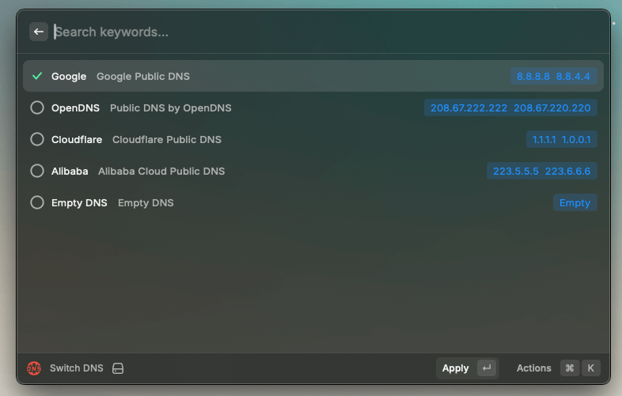

# raycast-extension-switch-dns

Quickly DNS switching with [Raycast](https://www.raycast.com/).



## Usage

```sh
git clone https://github.com/GallenHu/raycast-extension-switch-dns.git && cd raycast-extension-switch-dns
npm i
npm run dev
```
